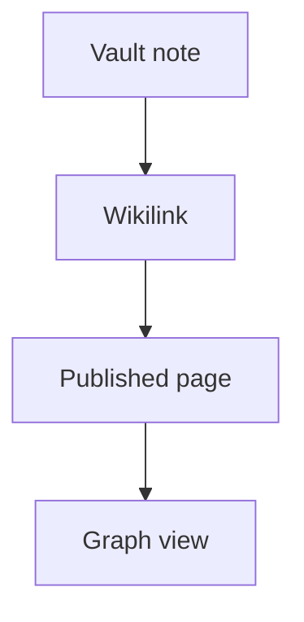

# Live Examples

This page demonstrates every feature of the plugin. Since the plugin is enabled on this documentation site, everything you see below is rendered live.

## Callouts

Static callouts with different types:

> [!success] Success Callout
> This is a success callout. Use it for positive outcomes.

> [!question] Question Callout
> This is a question callout. Use it for open questions.

> [!bug] Bug Callout
> This is a bug callout. Use it to track known issues.

> [!example] Example Callout
> This is an example callout. Use it for code samples or demonstrations.

> [!quote] Quote Callout
> This is a quote callout. Use it for citations or quotations.

> [!abstract] Abstract Callout
> This is an abstract callout (aliases: `summary`, `tldr`).

> [!failure] Failure Callout
> This is a failure callout. Use it for negative outcomes (aliases: `fail`, `missing`).

> [!check] Check Callout
> This is a check callout (alias of `success`; also: `done`).

Callout titles are inline markdown — **bold**, *italics*, `code`, and
[[markdown/guide/advanced|wikilinks]] all render inside the title:

> [!example] A **bold** title linking to [[markdown/guide/advanced|Advanced Configuration]]
> The title above renders markdown and resolved wikilinks, matching Obsidian.

Foldable callouts:

> [!success]- Collapsed by Default
> This content is hidden until the user expands the callout.
> You can put multiple paragraphs inside.
>
> - Lists work too
> - And other markdown

> [!example]+ Expanded by Default
> This content is visible immediately, but the user can collapse it.

Nested callouts (a callout inside another callout):

> [!example] Outer Callout
> This is the outer callout containing a nested question.
>
> > [!question] Nested Question
> > This inner callout is fully processed and styled.
>
> Back to the outer callout content. Everything renders correctly thanks to post-order processing.

Triple nesting also works:

> [!abstract] Level 1
> > [!question] Level 2
> > > [!failure] Level 3
> > > Deepest content here.

> [!question] What about `note`, `tip`, `warning`, `danger`, and `info`?
> Rspress ships its own GitHub-style alert transform that claims those types
> (plus `caution` and `details`) *before* plugin remark plugins run, and its
> conversion leaks Obsidian's fold suffix and drops the first paragraph of
> multi-paragraph alerts. This plugin detects those already-converted nodes,
> verifies them against the original source, restores the original
> blockquotes, and renders them with full Obsidian semantics — automatically,
> whenever `enableCallouts` is on. Standard `:::note` directive containers
> keep Rspress's native styling.

The types Rspress claims internally, restored and rendered by the plugin:

> [!note] Note Callout
> This is a standard note callout. Use it for general information.

> [!tip] Tip Callout
> This is a tip callout. Use it for helpful suggestions.

> [!warning] Warning Callout
> This is a warning callout. Use it for cautionary information.

> [!danger] Danger Callout
> This is a danger callout. Use it for critical warnings.

> [!info] Info Callout
> This is an info callout. Use it for supplementary details.

Foldable variants of the restored types — the fold suffix and first paragraph
survive the round trip through Rspress's transform:

> [!note]- Collapsed by Default
> This content is hidden until the user expands the callout.
> You can put multiple paragraphs inside.
>
> - Lists work too
> - And other markdown

> [!tip]+ Expanded by Default
> This content is visible immediately, but the user can collapse it.

Nested callouts using restored types:

> [!note] Outer Callout
> This is the outer note callout containing a nested tip.
>
> > [!tip] Nested Tip
> > This inner callout is fully processed and styled.
>
> Back to the outer callout content. Everything renders correctly thanks to post-order processing.

## Text Highlighting

You can ==highlight important text== using double equals signs. This is great for ==drawing attention== to key concepts in your documentation.

## Math

Inline math is written between single dollar signs: $E = mc^2$, and a formula
like $a^2 + b^2 = c^2$ flows with the text.

Display math uses double dollar signs:

$$
\int_0^1 x^2 \, dx = \frac{1}{3}
$$

KaTeX renders both, so the raw `$…$` is never shown. Prices such as $5 and $10
stay prose — inline math requires no space inside the delimiters.

## Mermaid Diagrams

A ` ```mermaid ` fence becomes a diagram, drawn in the browser with the same
renderer the canvas feature uses:



## Unresolved Links

A wikilink to a page that does not exist keeps the label a reader expects and
is marked as unresolved instead of becoming a link: [[not-a-real-page|Missing page]].

## Private Notes

A comment hides everything between its delimiters — paragraphs, lists and
headings included. A commented-out heading is dropped from the page outline and
the search index as well, so it is not published anywhere.

Visible text. %%

This paragraph is not published either.

- Neither is this list item.

%%

Still visible.

## Wikilinks

Link to other pages in your documentation:

- [[markdown/guide/getting-started|Getting Started Guide]] — the main installation and setup guide
- [[markdown/guide/advanced|Advanced Configuration]] — detailed options and behavior
- [[markdown/guide/api|API Reference]] — programmatic usage and types

Standard markdown links to vault pages resolve through the same rules — Obsidian accepts both syntaxes:

- [Markdown link to the guide](getting-started.md) — the `.md` destination is resolved like a wikilink
- [Markdown link to the vault root](/markdown/) — resolves the section root page, not a relative path. The trailing slash is what makes an index page resolve: Rspress rewrites a slash-less route to `/markdown.html`, and the file it published is `markdown/index.html`
- [Markdown link with an anchor](getting-started.md#Install) — `#anchor` destinations resolve to heading slugs

A block link reaches one paragraph, list item or table of another note:

- [[intro#^anchor-demo|A block in the vault's intro]] — hovering it previews only that paragraph

Current page anchor links:

- [[#Callouts]] — jump to the callouts section
- [[#Footnotes]] — jump to the footnotes section

## Reference-Style Links

A reference-style definition is a link like any other, and it counts as a
backlink to whatever it names — the graph view and the backlinks panel read
the same set, so they cannot disagree about the same vault:

- [the getting started guide by reference][gs]
- [a section of it by reference][gs-install]
- [[markdown/guide/advanced]] — the same target the wikilink above resolves to

The demo vault's `create a link.md` page does the same, which is why this page
appears in its backlinks panel.

A footnote or citation definition *looks* like one of these but addresses
nothing, so neither becomes a backlink: a note[^ref-not-a-link] and a
citation[~cite] stay out.

## Dataview Inline Queries

With `enableDataview` on, inline code that starts with `=` is a Dataview
inline query, evaluated with `this` as the current page — Dataview's own
syntax. This page's own name resolves:

The file name is `= this.file.name`, and its folder is `= this.file.folder`.

Inline code that starts with `$=` is inline DataviewJS: this site has
`$= dv.pages().length` pages.

Plain prose is never evaluated, so the sentence below reads exactly as written:

The speed = value.

## Canvas Cards

The demo board shows the canvas-specific behaviours, including the two a card
used to get wrong: `==highlights==` render inside a card, and
`![[Note#Heading]]` embeds one section instead of the whole note. See
[Canvas](/canvas/guide/getting-started).

[gs]: markdown/guide/getting-started.md
[gs-install]: markdown/guide/getting-started.md#Install
[~cite]: markdown/guide/advanced.md

[^ref-not-a-link]: A footnote definition is `[^id]: target` and a citation is `[~id]: target`; neither names a page, so neither is a link.

## Tags

This page has the tags #examples and #demo in its frontmatter. When `enableTagLinking` and `enableTagPages` are on, inline tags become links and auto-generated tag pages list all matching pages.

## Footnotes

Footnotes are useful for citations and references[^1]. You can also use inline footnotes^[Like this one, which appears in the text itself] for brief asides.

Multiple footnotes work fine too[^2]. They are collected and rendered at the bottom of the page automatically.

## Obsidian Comments

Comments are stripped from the output. %% This text will not appear in the rendered page. %% Only the visible text remains.

Multi-line comments are also stripped:

%%
This entire block
is a private note
and will not be published.
%%

## Media Embeds

Every image, audio, video and PDF format Obsidian accepts, each a real file in
the demo vault, lives on its own page: [Media Embeds](/markdown/guide/media-embeds).

## Transclusion Demo

The section below is transcluded from the Getting Started page. It demonstrates how `![[Page#Heading]]` embeds content from another file.

![[markdown/guide/getting-started#Embed & Transclusion Syntax]]

## Backlinks

Scroll to the bottom of this page to see the backlinks panel — it lists all pages that link to this one.

[^1]: This is a labeled footnote definition. It appears at the end of the page.
[^2]: Another labeled footnote. The plugin handles duplicates gracefully.
